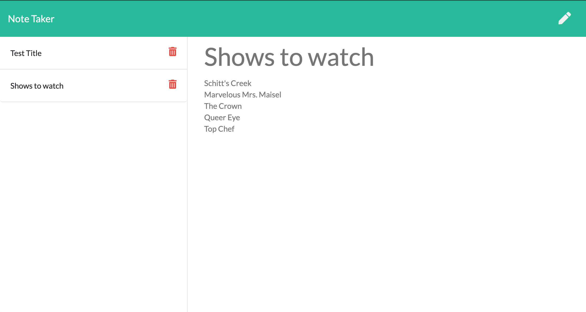

# Notepad

## Description
Need a place to organize and keep track of your thoughts and tasks? Notepad is an application that allowers users to write, save, and delete notes. It uses an Express backend to retrieve and save notes from a JSON file. Notepad is deployed through Heroku so you can access your notes at any time and it will always be up to date. 

## Features
* Express is used to create the back end of the application
    * HTML routes display the correct html file depending on the url path
    * API routes for GET, POST, and DELETE methods respond to AJAX calls from the front end to add, delete, and display notes
    * A JSON file is used as a "database" to store note data, routes pull from the JSON file to update and display notes
* Heroku
    * Used to run and deploy the app

## Built With
* [Heroku](https://heroku.com/) - cloud platform for running and deploying applications
* [Express](https://expressjs.com/) - a back end web application framework for Node.js
* [JSON](https://www.json.org/json-en.html) - lightweight data-interchange format for transmitting data objects
* [Node.js](https://nodejs.org/en/) - a JavaScript runtime environment that allows JavaScript to be run in command line
* [JavaScript](https://developer.mozilla.org/en-US/docs/Web/JavaScript) - code that creates the logic and structure of the program
* [Git](https://git-scm.com/) - version control system to track changes in source code
* [GitHub](https://github.com/) - hosts repository and deploys page on GitHub

## Deployed Application
[Notepad](https://fast-caverns-86008.herokuapp.com/)

## Code
The below code demonstrates how routes are used to send responses to POST requests

        app.post("/api/notes", (req, res) => {
            let newNote = (req.body);
            newNote.id = newNote.title.replace(/\s+/g, "").toLowerCase();
            readFileAsync(path.join(__dirname, "db/db.json"), "utf8").then(data => {
                const notesData = JSON.parse(data);
                notesData.push(newNote);
                return notesData;
            }).then(notesData => {
                writeFileAsync(path.join(__dirname, "db/db.json"), JSON.stringify(notesData));
                return res.json(notesData);
            })
        });

## Image
A sample of the Notepad application

## License
This project is licensed under the MIT license.

## Author
* Rebecca Eng
* [GitHub](https://github.com/engrebecca)
* [LinkedIn](https://www.linkedin.com/in/engrebecca/)
